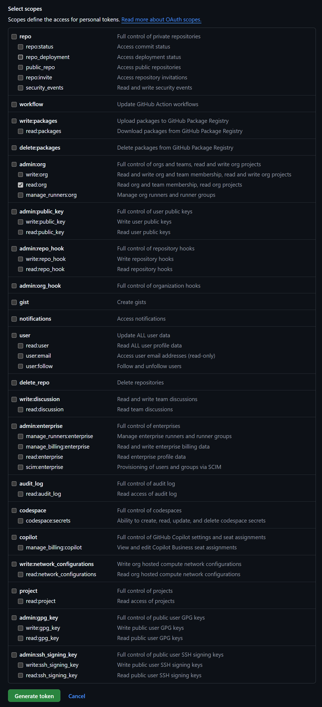

# MLE Evidence Project

## First Time Setup on Windows

### IDE and Framework Downloads
1. [VS Code](https://code.visualstudio.com/Download)
    - VS Code is our preffered IDE for Evidence development because it has a built in Evidence extension available to install and native git support.
    - VS Code should be used for all modifications to our Evidence repository.
2. [dbeaver](https://dbeaver.io/download/)
    - dbeaver's Community Edition is our preferred SQL IDE because it is open source and widely utilized in professional environments.  It makes connecting to databases and building SQL queries much easier than it is in VS Code.
    - If you're working directly with the SprocketDB or MLEDB databases, you'll need to use dbeaver (or another IDE) to connect directly to our databases.
    - Check the "Associate .sql files" option when installing
3. [Git](https://git-scm.com/downloads)
    - Git is the basis of all version control, allowing multiple developers to work on the same project at once.
    - If downloading on Windows, make sure to select the "Add to PATH" option when installing.


### Evidence Setup
1. Clone the Evidence Repository
    - In VS Code, hit `Ctrl+Shift+P` and type `Git: Clone`.  Hit enter or click on the matching result.
    - Paste the Evidence repo url into the text box and hit enter: https://github.com/Minor-League-Esports/evidence.git
    - Choose a destination folder to clone the repository into (usually people will just put it in their Documents folder).
    - A terminal window should open up saying the repo was successfully cloned.  VS Code may ask if you'd like to open up the repository, if so go ahead!

2. Download the Evidence VS Code Extension
    - Go to the Extensions menu of VS Code (located on the left toolbar, can just use `Ctrl+Shift+X` if you can't find it).
    - Search for "Evidence" in the search box.
    - Click Install for the "Evidence" and "DuckDB Driver for SQLTools" extensions.

3. Start Evidence Locally
    - You should now see a button on VS Code's bottom toolbar next to your branch management indicator that says "Start Evidence".
      - If you don't see this, try closing VS Code and then re-opening it with the folder that the repo is contained in.
    - Click the "Start Evidence" button.
      - If you get an error in the terminal that opens, try running the following commands one at a time in the same terminal:
        - `npm install`
        - `npm run sources`
        - `npm exec evidence dev -- --open`
      - The live testing/look at your changes should open in your browser after that last command.
      - Note that you wont need to do this again in the future, your "Start Evidence" should now work and open up in your browser as expected!


## Process Flow for Submitting Changes to the Evidence Repository
1. Before you make any changes to our Evidence repository, create a new branch via Git with the following format: `name/short_description_of_changes`
  - You can do this easily within VS Code by selecting the branch manager on the left of VS Code's bottom toolbar (it probably says "master" if this is your first time), then selecting "Create new branch..." on the pop-up at the top-center of VS Code.
2. Click the "Start Evidence" button on the bottom toolbar of VS Code, you'll see a local version of our Evidence site open in your browser which will update with a live preview of the changes you're making each time you save your file.
3. Make your changes, ensuring that they look the way you expect in the browser window.
4. Commit your changes to the branch you made and push the branch/commit to the remote repository.
5. Go to the remote respository (https://github.com/Minor-League-Esports/evidence/) and create a Pull Request to merge your changes into the the `main` branch of code (this branch is what's used to actually construct the published MLE Evidence website and will be visible to all).
6. Notify OwnerOfTheWhiteSedan to review your PR and approve it or provide feedback with requested changes!  Once it's approved, it can be merged and seen by the MLE community!


## Learning More
- Evidence
  - [Docs](https://docs.evidence.dev/)
  - [Github](https://github.com/evidence-dev/evidence)
  - [Slack Community](https://slack.evidence.dev/)
  - [Evidence Home Page](https://www.evidence.dev)
- Git
  - [Git Book](https://git-scm.com/book/en/v2)
  - [GitKraken Video Tutorials](https://www.gitkraken.com/learn/git/tutorials)
- SQL
  - [SQL Bolt](https://sqlbolt.com/)


## Working with dbeaver
This section assumes you're using dbeaver to access data and run queries.

### Using Sprocket Public Datasets in dbeaver
If you want to replicate using the Sprocket Public Datasets (like Evidence does) but in dbeaver in order to take advantage of it's features, you can achieve this by following these steps:
1. In dbeaver, create a new DuckDB database connection
2. In the connection details, type `:memory:` in the `Path:` field and then click the `Test Connection...` button on the bottom left of the connection settings box
3. The test should be successful, so you can click okay and close the connection settings!
4. Open the `Create All Sprocket Datasets.sql` file in the root directory of this repo as a dbeaver script
5. Click "Run Script" within dbeaver to create all of the Sprocket Public Datasets as temp tables stored in your local memory
6. From there, you can make a new script and reference the generated tables using queries such as the below, with your table name matching the name of a temp table generated by the script:
    ```
    SELECT *
    FROM players
    ```

### Connecting to SprocketDB or MLEDB Directly via dbeaver
If you want to work with the raw SprocketDB or MLEDB database data (to help with Sprocket datasets for example)
1. Work with OwnerOfTheWhiteSedan and/or Nigel Thornbrake to get access to the Sprocket repository.
2. Create a classic style GitHub Token [from this link](https://github.com/settings/tokens) and give it simply the `read:org` scope (as seen in the below screenshot) 
3. Once created, save the special text string somewhere you wont lose it.  Then, head to the [Sprocket Vault site](https://vault.spr.ocket.cloud/ui/) and select the `GitHub` method of sign in.  Use the token string provided and click "Sign In".
4. From here, select `database/` and input `data_science_main` as the "Role to use".
5. If successful, this should present you with with a username and password for accessing SprocketDB!  Save these somewhere useful, but note that they will only be valid for 1 month.  Each month you'll need to come generate new credentials from the Vault.
6. Within dbeaver, create a new Postgres database connection using the following credentials:
    - Host: `db.spr.ocket.cloud`
    - Port: `30000`
    - Database: `sprocket_main`
    - Username: provided by Vault
    - Password: provided by Vault
7. Click the "Test Connection..." button and, if successful, enjoy writing SQL using all of the raw data available to MLE!
